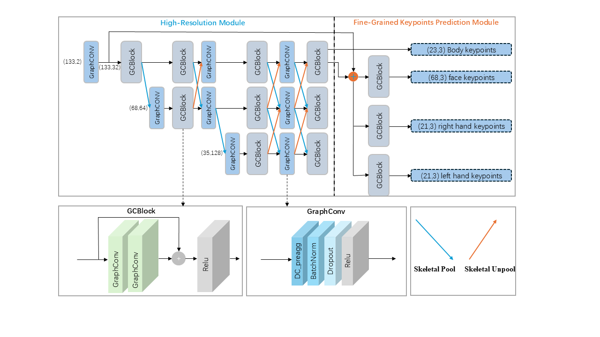

# 2D-3D Whole-body Pose Estimation for Robot Teleoperation via High-Resolution Graph Convolutional Network
<a href="https://hits.seeyoufarm.com"></a>
</a>
<p align="center"></p>


This repository contains the pytorch implementation of the approach described in the paper:
> Mingyu Zhang,Yuanchuan Lai ,Yang Zhang ,Qing Gao. 
[2D-3D Whole-body Pose Estimation for Robot Teleoperation via High-Resolution Graph Convolutional Network](https://github.com/Z-mingyu/HR-GCN.git)


## Introduction & Dataset

We train and evaluate models for 3D whole-body pose estimation on the [H3WB](https://github.com/wholebody3d/wholebody3d).

Train_data [Download Link.](https://drive.google.com/file/d/1eCV-oxneE6NTnsO3z_eR_uLaE6wByx2J/view?usp=drive_link)

Test_data [Download Link.](https://drive.google.com/file/d/1vtYZiUQu6X_aT6vx2bb0sNdGIkS7xY3A/view?usp=drive_link)

Please put the train_data and test_data in the data directory

Whole-body 2D joints of the human pose are exploited as inputs. 2D poses are scaled according to the image resolution and normalized to [-1, 1]; 3D poses are aligned with respect to the root joint and the unit of 3D pose data changed from millimeter to meter. 

Please refer to [VideoPose3D](https://github.com/facebookresearch/VideoPose3D) for the visualization code.
## Quickstart

This repository is build upon Python v3.8 and Pytorch v1.13.1 on Ubuntu 20.04 LTS. All experiments are conducted on a single NVIDIA RTX 3090 GPU. See [`requirements.txt`](requirements.txt) for other dependencies. Then you can install dependencies with the following commands.

```
git clone https://github.com/Z-mingyu/HR-GCN.git
cd HR-GCN
pip install -r requirements.txt
```

### Evaluation 
```
python HRNet_GCN_WB.py --model 1/2/3/4/5 --gcn {gcn_name}  --evaluate checkpoint/{weight_name}.pth.tar -cfg checkpoint/w32_adam_lr1e-3.yaml
```

### Training
```
# Decoupled Vanilla GCN (What method used in paper)
python HRNet_GCN_WB.py --gcn dc_vanilla --model 1/2/3/4/5

# Decoupled Pre-Aggresive GCN (What method used in paper)
python HRNet_GCN_WB.py --gcn dc_preagg --model 1/2/3/4/5

# Semantic GCN (What method used in paper)
python HRNet_GCN_WB.py --gcn semantic --model 1/2/3/4/5

# Decoupled Post-Aggresive GCN
python HRNet_GCN_WB.py --gcn dc_postagg --model 1/2/3/4/5

# Convolution-style GCN
python HRNet_GCN_WB.py --gcn convst --model 1/2/3/4/5

# No-sharing GCN
python HRNet_GCN_WB.py --gcn nosharing --model 1/2/3/4/5

# Modulated GCN
python HRNet_GCN_WB.py --gcn modulated --model 1/2/3/4/5
```
model 1/2/3/4/5 for HRGCN/GraphResNet/HRGCN*/GraphSH/GraphResNet†

### Pre-trained weight
The best checkpoint has been uploaded with  hyper-parameters and configuration file

[Download Link.](https://drive.google.com/file/d/17-g50KSndfzAbFfr9-uFZEQqP2xypAqm/view?usp=drive_link)


### Acknowledgement
This code is extended from the following repositories.
- [VideoPose3D](https://github.com/facebookresearch/VideoPose3D)
- [Semantic GCN](https://github.com/garyzhao/SemGCN)
- [Modulated-GCN](https://github.com/ZhimingZo/Modulated-GCN)
- [GraphSH](https://github.com/tamasino52/GraphSH)
- [H3WB](https://github.com/wholebody3d/wholebody3d)

Thank you to authors for releasing their code. Please also consider citing their works.
